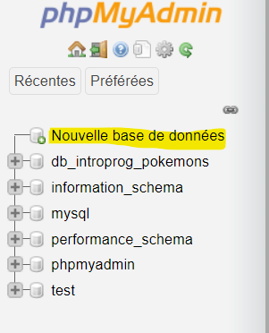
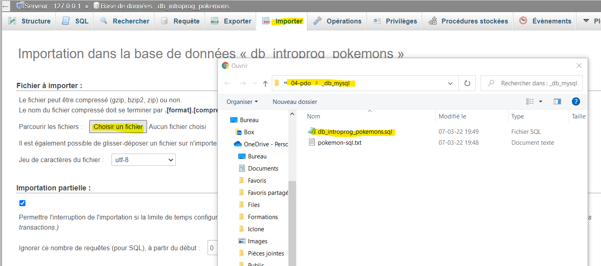
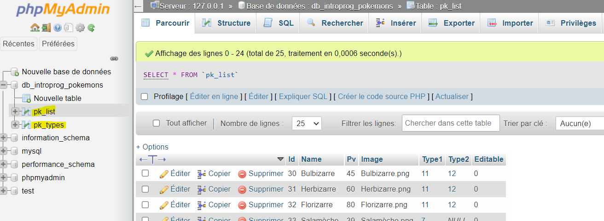

# Exercice 4 : PHP Data Objects

# Attrapez les tous ! : Pokédex


Il est temps de passer aux choses sérieuses, les bases de données avec PDO (PHP Data Objects).

Et créer son Pokédex ! (bon, on se contentera des 25 premiers Pokémons de la Génération 1).

## La base de données

Connectez-vous à PHPMyAdmin [http://localhost/phpmyadmin](http://localhost/phpmyadmin).

Connectez-vous à PHPMyAdmin [http://localhost/phpmyadmin](http://localhost/phpmyadmin).

- Admin: root
- PW: vide

Attention, nous garderons ces valeurs par défaut pour les exercices, mais pour des applications "pro", veuillez sécurisez vos accès !

Pour le type de DB, choisissez Maria DB.

Sur Mac, il n'est pas possible d'utiliser Maria DB avec MAMP, il faudra utiliser XAMPP.

Créez la base de données _db_introprog_pokemons_



Sélectionnez la base de données _db_introprog_pokemons_ dans l'interface, et importez la DB (04-pdo/\_db_mysql/db_introprog_pokemons.sql).



Vous avez à présent deux tables.

- pk_list : contient la liste des Pokémons, avec leur Id (auto-incrémenté), Name, Pv, Image, Type1, Type2, Editable
- pk_types : la liste des 18 types de Pokémons.



## Exercice partie 1: affichage des données

### Connexion à la base de données

- Comme vu dans la théorie créez dans un try/catch la connexion à la DB. Après avoir confirmé que la connexion se faisait bien, mettez-là dans une fonction afin de pouvoir faire la connexion à la DB lorsque vous en aurez besoin dans l'application. Par exemple `function connectDB()`.

### Créez 2 fonctions avec des requêtes SQL

- Une pour lister tous les personnages et leurs caractéristiques (ex: `getAllPokemons()`).
- Une pour lister les différents types de Pokémons (ex: `getTypes()`).

_Tip_: Dans chacune des fonctions, retournez un tableau avec les jeux de données (via un `return`)

## Récupérez les données

Dans un try / catch, lancez vos fonctions pour récupérer les jeux de données, en vous étant connecté à la DB via la fonction créée dans la première étape.

### Affichez les Pokémons dans des tables HTML

Afficher la liste des Pokémons dans une table HTML.


### Affichez les types

Créez une fonction qui va afficher les types de Pokémons au lieu de leur clé. Cette fonction pourra être appellée au niveau de la création du tableau.

_Tip_:

- Pour convertir un élement de tableau vers un string:

```php
json_encode($value["myValue"]);
```

- Pour enlever les guillemets qui sont retournés dans la string:

```php
trim($value, '"');
```


## Exercice partie 2: édition des données

La soumission du formulaire se fait dans le try / catch ou vous lancez vos fonctions de récupération des Pokémons.

### Effacer un Pokémon (Delete)

Lorsqu'un Pokémon est éditable (par défaut, seul Pikachu est éditable). Ajoutez un bouton delete dans la colonne éditable.

Ajoutez dans votre code la prise en charge de la soumission du formulaire ainsi qu'une fonction qui va effacer le Pokémon.

_Tip_:

- Vous aurez besoin d'un champ caché lors de la soumission du formulaire afin de passer l'Id du Pokémon ([Théorie](https://github.com/Raigyo/introprog2022a-php/blob/main/03-php-theorie/02-formulaires/08-form-hidden.php))
- N'oubliez pas de protéger vos valeurs (_bindValue_)
- Dans le HTML qui se trouve dans un echo, si vous voulez utiliser une variable, au lieu de concaténer on peut utiliser les _template strings_ `value="{$value['Id']"}`
- Pour recharger la page courrante après une opération:

```php
header('Location: '.$_SERVER['PHP_SELF']);
```

Pour remettre Pikachu via le SQL de PHPMyAdmin:

```sql
INSERT INTO pk_list VALUES (NULL, 'Pikachu', '35', 'Pikachu.png', '5', NULL, '1');
```


### Ajouter un Pokémon

Avant le listage du tableau, ajoutez un champ pour ajouter un Pokémon. L'utilisateur pourra ajouter un nom, des PV (entre 1 et 50) et choisir un type dans un menu déroulant (`select`).

Les autres valeurs seront par défaut.

- ID auto
- Type 2: Null
- Image: _Default.png_

N'oublez pas de protéger vos valeurs dans la fonction avec la requête (et ici il y a une string).


### Modifier un Pokémon

Enfin, pour les Pokémons éditables, créez un champ qui permettra de modifier les points de vie du Pokémon.


