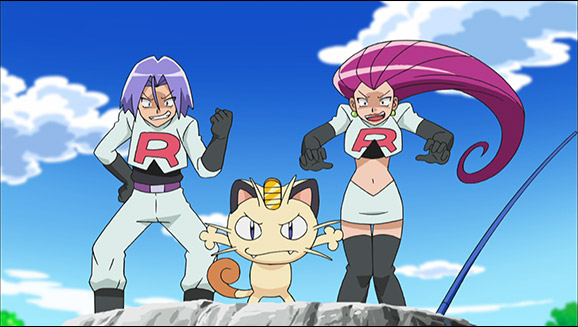

# Exercice 5 : MVC

# On est de retour...

La Team rocket vous a volé votre Pokédex ! (oui, celui que vous venez de réaliser!)

Qu'importe, vous allez en réaliser un autre... en mieux!

## Team group: Architecture MVC

Par groupe de 2, 3 élaborez un plan d'architecture MVC pour l'application Pokédex. Durée 10-15 minutes.

## Solo (mais avec Team spirit): Refactoring

Intégrez votre application précédente afin qu'elle corresponde au motif MVC.
