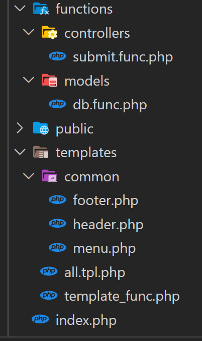

# Exercice 5 : MVC

# On est de retour...

La Team rocket vous a volé votre Pokédex ! (oui, celui que vous venez de réaliser!)

Qu'importe, vous allez en réaliser un autre... en mieux!

## Team group: Architecture MVC

- Par groupe de 2, 3 élaborez un plan d'architecture MVC pour l'application Pokédex. Durée 10 minutes.

- Mise en commun. Durée 10 minutes.

Rappel :

**Modèle** : cette partie gère les données du site. Son rôle est d'aller récupérer les informations « brutes » dans la base de données, de les organiser et de les assembler pour qu'elles puissent ensuite être traitées par le contrôleur. On y trouve donc entre autres les requêtes SQL.

**Vue** : cette partie se concentre sur l'affichage. Elle ne fait presque aucun calcul et se contente de récupérer des variables pour savoir ce qu'elle doit afficher. On y trouve essentiellement du code HTML mais aussi quelques boucles et conditions PHP très simples, pour afficher par exemple une liste de messages.

**Contrôleur** : cette partie gère la logique du code qui prend des décisions. C'est en quelque sorte l'intermédiaire entre le modèle et la vue : le contrôleur va demander au modèle les données, les analyser, prendre des décisions et renvoyer le texte à afficher à la vue. Le contrôleur contient exclusivement du PHP. C'est notamment lui qui détermine si le visiteur a le droit de voir la page ou non (gestion des droits d'accès).

[Liens vers les slides de présentation](https://docs.google.com/presentation/d/1SlwMRsxHz1L_GwfpvWSAL07S2OQol3p5IaDyxTBI57w/edit?usp=sharing)

## Solo (mais avec Team spirit): Refactoring

Intégrez votre application précédente afin qu'elle corresponde au motif MVC.

Voici une proposition d'architecture.

Pensez à appeller vos fichier via _require_ ou _include_. Attention, l'ordre d'appel des fichiers a son importance. Vous pouvez importer la plupart de vos fichiers dans la page index.

Pour la partie vue, pensez à séparer la logique de construction des templates html et la logique PHP (boucles...) dans deux fichiers séparés (voir capture de l'architecture).

## Améliorations

Vous avez réussi à intégrer votre application Pokédex dans une architecture, MVC, c'est bien!

Voici quelques idées challenge d'amélioration :

- Ajouter Pokémon : permettre l'ajout d'un deuxième type dans une liste déroulante. Le premier type est obligatoire, le deuxième peut être nul.

- Ajouter Pokémon : ajouter un champ (radio ou checkbox), pour permettre de choisir si le Pokémon est éditable ou non.

- Ajouter Pokémon : permettre l'ajout et l'upload d'une image. On a vu comment faire dans la partie sur les sessions. Pensez à donner un nom unique à vos images. Votre dossier upload devra se trouver dans la partie statique du site.

- Delete Pokémon : lorsque la feature précédente est ajoutée, vous allez vous retrouver avec de nombreux upload d'images. Il serait bon de penser à les effacer sur le serveur lorsqu'on delete un pokémon. Cet exercice a pour but de vous apprendre à vous débrouiller avec une documentation : [https://www.phptutorial.net/php-tutorial/php-delete-file/](https://www.phptutorial.net/php-tutorial/php-delete-file/)

## Améliorations 2

Vous avez implémenté toutes ces amélioration ? C'est super !

Voici une dernière suggestion.

Pour l'édition implémentez une boîte modale lorsqu'on clique sur le bouton modifier.

Les champs de cette boîte devront afficher les données du Pokémon déjà présentes dans la db. Et ils devront être modifiables.

Commencez en douceur, juste avec un champ modifiable et lorsque ça fonctionne attaquez-vous aux autres champs.

Si vous vous attaquez au champ de l'image, si l'utilisateur remplace l'image, penser à effacer l'ancienne sur votre serveur.
