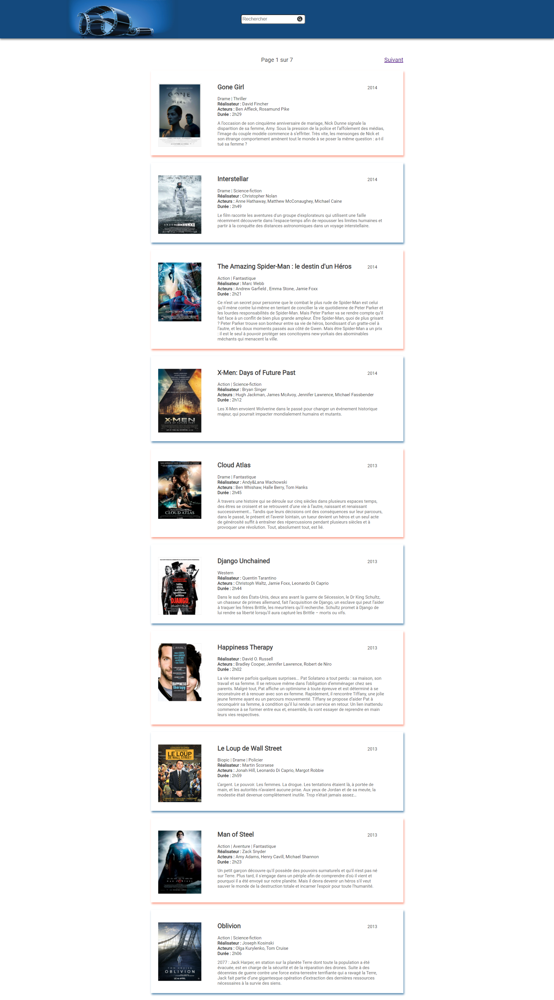
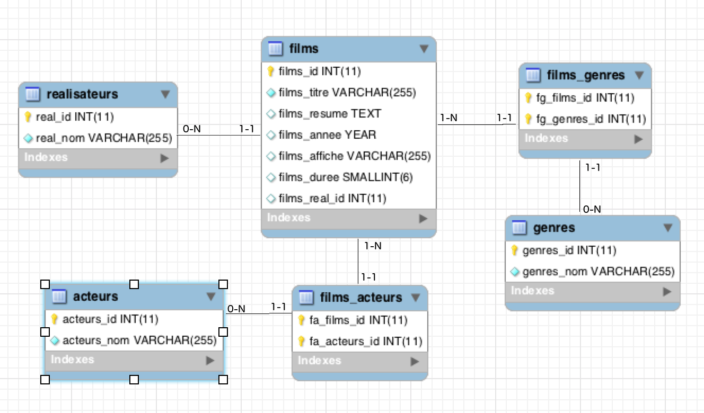

# Introprog 2022a : LABO PHP

Voici venu le temps de l'épreuve finale qui va vous permettre de mettre en pratique toutes les belles choses que nous avons apprises en PHP !

Nous allons réaliser une médiathèque en PHP!

## Afficher les films

Dans notres database, nous avons une liste de films, que nous devrons afficher à l'écran.

Y'en a une blinde donc on va éviter de les afficher tous.

Il faudra, de façon dynamique créer plusieurs pages avec 10 films par page.

Et trouver un moyen de créer un système à la "Google", où l'on puisse afficher juste 10 films, puis en afficher de nouveau 10 sur la page suivante...

## Bouton recherche

Y'a trop de films, ce serait bien de pouvoir faire une recherche sur les films présents dans la data base non?

On ajoutera pour le coup un bouton de recherche !

## Trop facile ce labo, "Les Simpson l'ont déjà fait" (mais ça avait déjà été fait dans la 4ème dimension)...

Oui... mais non...

C'est qu'il ne s'agit pas de lister les films comme ça d'un simple coup depuis juste une table...

Y'en à plusieurs...

Ben oui, on va quand même aller récupérer le nom du réalisateur, les acteurs et le genre du film dans une autre table...

C'est d'ailleurs une bonne façon de faire...

Comme ça si on devait changer le nom du réalisateur, ça irait se changer sur tout les films auxquel il a participé... Puis ça évite de réencoder son nom à chaque fois...

Exemple : Larry Wachowski change d'identité pour Lana Wachowski... On change une fois son nom dans la DB...

## La DB, l'univers et le reste...

La DB et les assets (images, css...) sont offerts par la maison, le _Le Dernier Restaurant avant la fin du monde_...

On va créer une DB via PHPMyAdmin et d'y importer le fichiers SQL présent dans \__db_mysql_.

Pourquoi pas _introprog2022a-labo_?

## MVC

On n'oublie pas ce qu'on a appris, on va mettre le tout dans une architecture MVC...

## Alone in the Dark

J'encourage le partage et le travail de groupe MAIS...

- Tout le monde doit bosser sur le projet
- Personne ne doit rester sur le carreau, tout le monde doit comprendre ce qui est fait...

## C'est trop facile ce labo

N'hésitez pas à me le faire savoir...

Il y a moyen de rajouter du challenge...

---

# Challenge accepted

Si vous êtes arrivé jusqu'ici, le labo est réussi félicitations !

Pour les améliorations, je vous suggère de travailler chacun de votre côté (même si vous pouvez toujours faire du pair coding ou partager des infos).

Ces améliorations ne doivent pas nécessairement être faites dans l'ordre...

Il est probable que vous n'arriviez pas au bout, ce n'est pas grave, vous aurez ainsi des challenges à effectuer après la formation.

## 1. Filtre par genre

Ajouter une select box (ou autre à vous de voir niveau design) qui permettra de sélectionner un genre et de n'afficher que les films concernant ce genre...

## 2a. Ajouter un film (programmation procédurale)

Donner la possibilité d'ajouter un film avec toutes les données associées. On l'avait déjà fait avec le Pokédex. C'est l'occasion de voir si vous pourrez le refaire.

Par contre le formulaire devra se trouver dans une autre page accessible depuis un menu ou un bouton "Ajouter un film".

## 2b Ajouter un film (programmation orientée objet)

Challenge: la même chose, mais en utilisant une classe et un constructeur...

[Théorie: 08-poo](../08-poo)

## 3. Connexion utilisateur

Pour cela vous devrez créer une nouvelle table _users_.

Avec un champ pour le nom d'utilisateur, un pour l'adresse email, un pour le password et un pour le rôle.

Les rôles seront dans une autre table et contiendront une liste de rôles: user, editor et admin.

Dans l'application il faudra un input avec incription / login.

Lorsqu'un utilisateur est inscrit il pourra se loguer au site.
Une fois logué le bouton devra changer pour logout.

Prévoyer que cette partie (login/logout) doit pouvoir apparaître sur toutes les pages du site (par exemple la page d'ajout de films). Et que la connexion au site doit rester tout le temps valide d'une page à l'autre.

Ajouter une page dans le site et accessible depuis un menu ou un bouton: "Ajouter un film". (si ça n'a pas été fait dans le challenge)

Vous devrez utiliser une variable de session utilisateur et elle devra rester active sur tout le site.

Dernière chose, le bouton/menu "Ajouter un film" ne sera pas visible depuis la homepage si l'utilisateur n'est pas connecté et n'est pas editor ou admin.

Egalement si quelqu'un essaye de se connecter d'une façon ou d'une autre à la page "Ajouter un film" sans être editor ou admin, la page doit afficher à l'utilisateur qu'il n'a pas les droits nécessaires pour accéder à la page.
