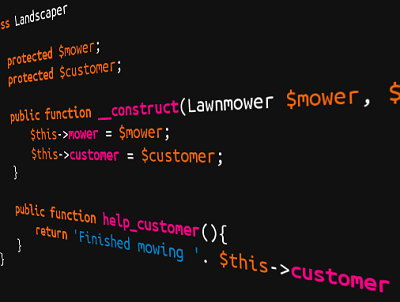

# Introprog 2022a : Programmation orientée objet (POO / OOP)

La programmation orientée objet est un modèle de langage de programmation qui s'articule autour d'objets et de données, plutôt que d'actions et de logique. Contrairement à la programmation procédurale qui récupére des données en entrée, les traite puis produit des données en sortie.

## Notions fondamentales

### Classes, objets et encapsulation

Les **classes** sont des moules, des patrons qui permettent de créer des objets en série sur le même modèle. On peut se représenter une classe comme le schéma de construction ainsi que la liste des fonctionnalités d’un ensemble d’objets.

Chaque **objet** créé depuis une classe est une **instance / occurrence** de classe. Cette dernière est elle-même définie comme la structure d'un objet, c'est-à-dire comme l'ensemble des fonctionnalités et des comportements qui caractérisent cet objet.

Le fait de catégoriser des objets dans une classe s'appelle **encapsulation**.

L’instanciation d’une classe fait appel à 3 méthodes: le constructeur, les accesseurs (get) et les mutateurs (set) et le destructeur.

### Abstraction

L'objectif principal de l'abstraction est de gérer la complexité en masquant les détails inutiles à l’utilisateur. Cela permet à l’utilisateur d’implémenter une logique plus complexe sans comprendre ni même penser à toute la complexité cachée.

L'abstraction réduit donc la complexité du code en cachant des détails et en exposant les fonctionnalités essentielles. L'abstraction des données se fait à l'aide de classes abstraites et d'interfaces.

### Héritage

Cette notion désigne le fait qu’une classe peut hériter des caractéristiques (attributs et méthodes) d’une autre classe.

Une classe B qui hérite d’une classe A est une sous-classe de A, et A est la super-classe de B.

### Polymorphisme

Le polymorphisme permet de modifier le comportement d'une classe fille par rapport à sa classe mère. Le polymorphisme permet d'utiliser l'héritage comme un mécanisme d'extension en adaptant le comportement des objets.

Le polymorphisme est relatif aux méthodes des objets.

## Concepts supplémentaires

### Surcharge / overloading

La surcharge, aussi appelée « overloading », consiste à déclarer, dans une même classe, deux méthodes de même nom mais avec des sémantiques différentes.

Par exemple une méthode ne prenant pas de paramètres et une autre de même nom qui en prend.

### Redéfinition / overriding

La redéfinition de fonction est un concept que l’on rencontre lors de la création de sous-classes. Ici, l'on déclare une sous-classe et crée une fonction avec le même nom et les mêmes arguments qu’une fonction dans la classe de base, la fonction associé à la sous-classe sera exécuté.

## Liens utiles

- [Programmation orientée objet : qu’est-ce que c’est et à quoi ça sert ?](https://www.lebigdata.fr/programmation-orientee-objet)
- [Programmation Orientée Objet (POO) : le guide ultime](https://datascientest.com/programmation-orientee-objet-guide-ultime)
- [Apprendre la programmation orientée objet par la pratique](https://www.data-transitionnumerique.com/apprendre-programmation-objet/)
